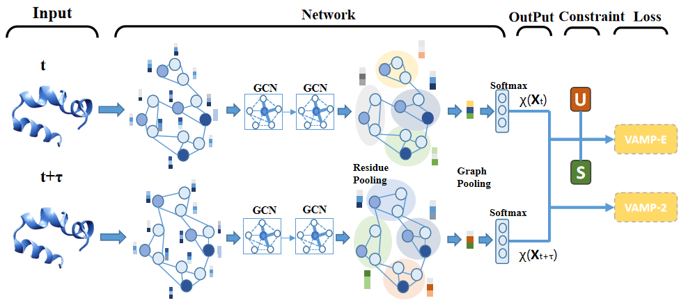

# RevGraphVampNet



This repo contains the code for **RevGraphVAMPNet**

## REVGraphVAMPNet code

## Usage

### training
```
python train.py --pre-train-epoch 300 --epochs 1000  --batch-size 500 --lr 0.0005 
--hidden 16  --num-atoms 42 --num-classes 4 --num_neighbors 10 --conv_type SchNet 
--dmin 0 --dmax 8. --step 0.5 --dist-data ../intermediate/red_5nbrs_1ns_dist_min.npy 
--nbr-data ../intermediate/red_5nbrs_1ns_inds_min.npy  
--data-info ../intermediate/red_5nbrs_1ns_datainfo_min.npy --residual  
--train  --score-method VAMPCE --save-folder ab_sch4_1 
```
### testing

```
python train.py --pre-train-epoch 300 --epochs 1000  --batch-size 500 --lr 0.0005 
--hidden 16  --num-atoms 42 --num-classes 4 --num_neighbors 10 --conv_type SchNet 
--dmin 0 --dmax 8. --step 0.5 --dist-data ../intermediate/red_5nbrs_1ns_dist_min.npy 
--nbr-data ../intermediate/red_5nbrs_1ns_inds_min.npy  
--data-info ../intermediate/red_5nbrs_1ns_datainfo_min.npy 
--residual  --score-method VAMPCE --return-emb --return-attn --score-method VAMPCE
 --save-folder abred_all_1 --trained-model ab_sch4_1/best_allnet.pt
```

## Requirements
- pytorch
- deeptime
- torch_scatter


## Sources:
- VAMPNet code is based on deeptime package [deeptime](https://deeptime-ml.github.io/latest/index.html)
- GraphNet code is based on the [GraphVampNet](https://github.com/ghorbanimahdi73/GraphVampNet)
- SchNet code is based on the [cgnet](https://github.com/brookehus/cgnet)
- physical constraint code is based on the [RevNet](https://github.com/vendruscolo-lab/ab42-kinetic-ensemble)

## Cite
If you use this code please cite the following paper:

```
Ying Huang ...
```
